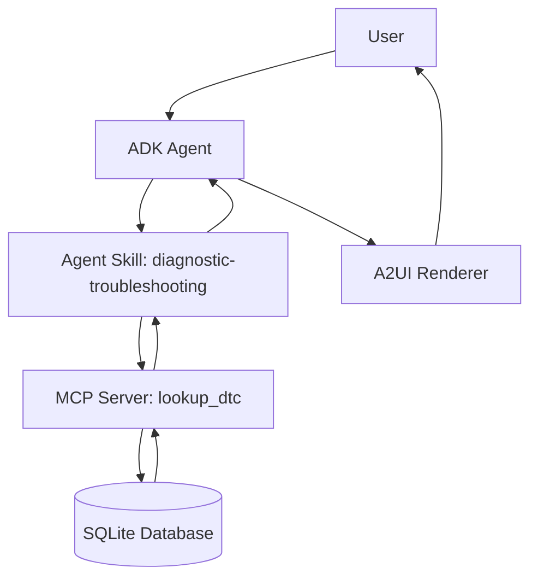

# DiagAssist – Autonomous Automotive Repair Planner

DiagAssist is an AI-powered diagnostic assistant that takes a vehicle Diagnostic
Trouble Code (DTC), retrieves grounded repair information through an MCP Server,
reasons about the fault using an Agent Skill, and returns a structured repair plan
through an A2UI-style interface (Repair Card + Checklist + Status Badge).

Built for a Business AI Agent Hackathon to demonstrate MCP integration, Agent
Skills, an ADK-style agent framework, A2UI rendering, and evaluation-driven
development — all running fully locally with no cloud dependencies.

## Features

- 🔍 **Grounded diagnosis** — every fact in a response comes directly from a
  local SQLite database via the `lookup_dtc` MCP tool. No hallucinated repair steps.
- 🧠 **Agent Skill** — a documented `SKILL.md` defines exactly when to use the
  tool, when to refuse, and how to handle multiple or invalid codes.
- 🔌 **MCP Server** — a standalone server exposing `lookup_dtc` over stdio,
  usable by any MCP-compatible agent framework.
- 🖥️ **A2UI rendering** — structured agent output is rendered as a Repair Card
  with a color-coded severity badge and a repair checklist.
- ✅ **Evaluation-driven development** — an automated `evals.py` suite checks
  valid codes, natural-language questions, refusals, invalid codes, and
  multi-code requests.

## Architecture



See `specs/technical_design.md` for the full design document, data flow,
risks, and mitigations.

## Repository Structure

```
DiagAssist/
│
├── specs/
│   └── technical_design.md
├── database/
│   ├── dtc_data.json
│   ├── database.py
│   └── dtc_database.db        (generated)
├── skills/
│   └── diagnostic-troubleshooting/
│       └── SKILL.md
├── mcp/
│   └── mcp_server.py
├── ui/
│   └── ui_renderer.py
├── tests/
│   └── evals.py
├── agent.py
├── main.py
├── README.md
├── requirements.txt
└── pitch.md
```

## Setup Instructions

### 1. Clone / unzip the project

```bash
cd DiagAssist
```

### 2. Create a virtual environment (recommended)

```bash
python -m venv venv
source venv/bin/activate   # on Windows: venv\Scripts\activate
```

### 3. Install dependencies

```bash
pip install -r requirements.txt
```

### 4. Build the local database

```bash
cd database
python database.py
cd ..
```

This reads `database/dtc_data.json` and creates `database/dtc_database.db`.

## Running the MCP Server

The MCP server can be run standalone (useful for testing with any MCP client,
or wiring into a different agent framework):

```bash
cd mcp
python mcp_server.py
```

It communicates over stdio and exposes one tool: `lookup_dtc(code: str)`.

## Running the Agent

For the full interactive experience (agent + A2UI rendering together):

```bash
python main.py
```

Example session:

```
> P0420

┌─ Repair Card: P0420 ───────────────────────────
│ Severity:     🟡 MEDIUM
│ Repair Time:  2 Hours
│
│ Description:
│   Catalyst System Efficiency Below Threshold (Bank 1)...
│
│ Checklist:
│ ✓ Inspect catalytic converter for physical damage or contamination
│ ✓ Check upstream and downstream O2 sensors for correct operation
│ ✓ Verify there are no exhaust leaks before or after the catalyst
│ ✓ Clear the code and perform a drive cycle to confirm repair
└───────────────────────────────────────────────────
```

You can also run the agent without the UI layer:

```bash
python agent.py
```

## Running Evaluations

```bash
python tests/evals.py
```

This runs 7 automated test cases (valid code, natural-language question,
off-topic refusal, invalid code, multiple codes, malformed code handling,
and a memory follow-up test) and prints a pass/fail report. The script
exits with a non-zero status if any test fails, so it can be wired into CI.

## Sessions & Memory (Day 3)

Every `DiagAssistAgent` instance keeps:
- **Working memory** — the last few DTC lookups in the current process, so
  follow-up questions like "how serious is that?" resolve against the most
  recently discussed code without repeating it.
- **Long-term memory** — every lookup is appended to `memory/history.jsonl`,
  which persists across process restarts.

Try it:
```bash
python main.py
> P0420
> how serious is that?
```

## Observability & Grounding Evaluation (Day 4)

```bash
python observability.py   # prints a metrics report from logged activity
python judge.py            # checks that responses are faithfully grounded
```

- `observability.py` — structured logs (`logs/tool_calls.jsonl`) and traces
  (`logs/traces.jsonl`) of every query, plus an aggregate metrics report
  (success rate, refusal rate, latency, most-queried codes).
- `judge.py` — a deterministic grounding judge that checks every fact in a
  rendered response (severity, time, repair steps) against the raw
  `lookup_dtc` tool output, catching any fabricated or altered facts. It
  also includes `llm_judge_prompt()`, a ready-to-use prompt for a real
  LLM-as-Judge evaluation of clarity/tone (requires a Gemini API key to
  actually execute — see `agent_adk.py`).

## Real ADK Agent (Optional)

`agent_adk.py` swaps the rule-based agent for a real `google.adk.agents.Agent`
with `lookup_dtc` registered as a proper `FunctionTool`. Requires
`pip install google-adk` and a `GOOGLE_API_KEY` with active Gemini quota.

## Real MCP Protocol Test

```bash
python tests/test_mcp_client.py
```

Spawns `mcp_server.py` as a subprocess and talks to it over the actual MCP
stdio protocol (not just a direct function call) — confirms tool
registration and both successful and "not found" lookups work end-to-end.

## A2A Protocol — Multi-Agent Demo (Day 5)

DiagAssist's Diagnosis Agent can call a second, fully independent agent —
the **Parts Agent** — over HTTP, following the A2A pattern of Agent Card
discovery followed by task-based message passing between separate
processes.

> **Note on SDK versioning:** the official `a2a-sdk` package implements its
> Agent Card and message types as protobuf messages in current releases, a
> notably different and heavier surface than the pydantic-based API shown
> in most A2A tutorials. `a2a/parts_agent_server.py` and
> `a2a/a2a_client.py` implement the same core A2A pattern (Agent Card +
> task messages between independent agents) using plain FastAPI/httpx so
> it's runnable today. Swapping in the official SDK later only requires
> replacing the FastAPI routes — the agent logic itself doesn't change.

**Run the Parts Agent** (in its own terminal):
```bash
python a2a/parts_agent_server.py
# Listens on http://127.0.0.1:8001
```

**Check its Agent Card** (in another terminal):
```bash
curl http://127.0.0.1:8001/.well-known/agent.json
```

**Run the main app** — with the Parts Agent running, every successful DTC
lookup now also shows a "Likely Parts Needed (via Parts Agent / A2A)"
section, fetched live from the second agent:
```bash
python main.py
> P0420
```

If the Parts Agent isn't running, DiagAssist degrades gracefully — the
diagnostic response still works, it just omits the parts estimate.

## Screenshots

> _Placeholder — add terminal screenshots or A2UI web renders here for the
> hackathon submission._

`[ Screenshot 1: CLI session showing a successful P0420 lookup ]`

`[ Screenshot 2: evals.py pass/fail report ]`

## Future Improvements

- Swap the rule-based code extraction / refusal logic in `agent.py` for an
  actual LLM call (e.g. Claude) for richer natural-language understanding,
  while keeping the grounding constraint that all facts must come from
  `lookup_dtc`.
- Expand `dtc_data.json` with the full SAE J2012 DTC list, or connect to a
  live vehicle's OBD-II port via an ELM327 adapter for real-time codes.
- Add a real A2UI JSON schema renderer for native mobile/web display instead
  of the current text-based card renderer.
- Add user history/session tracking so a service advisor can review past
  diagnostic sessions for a given vehicle.
- Add authentication and multi-shop support for a production deployment.
