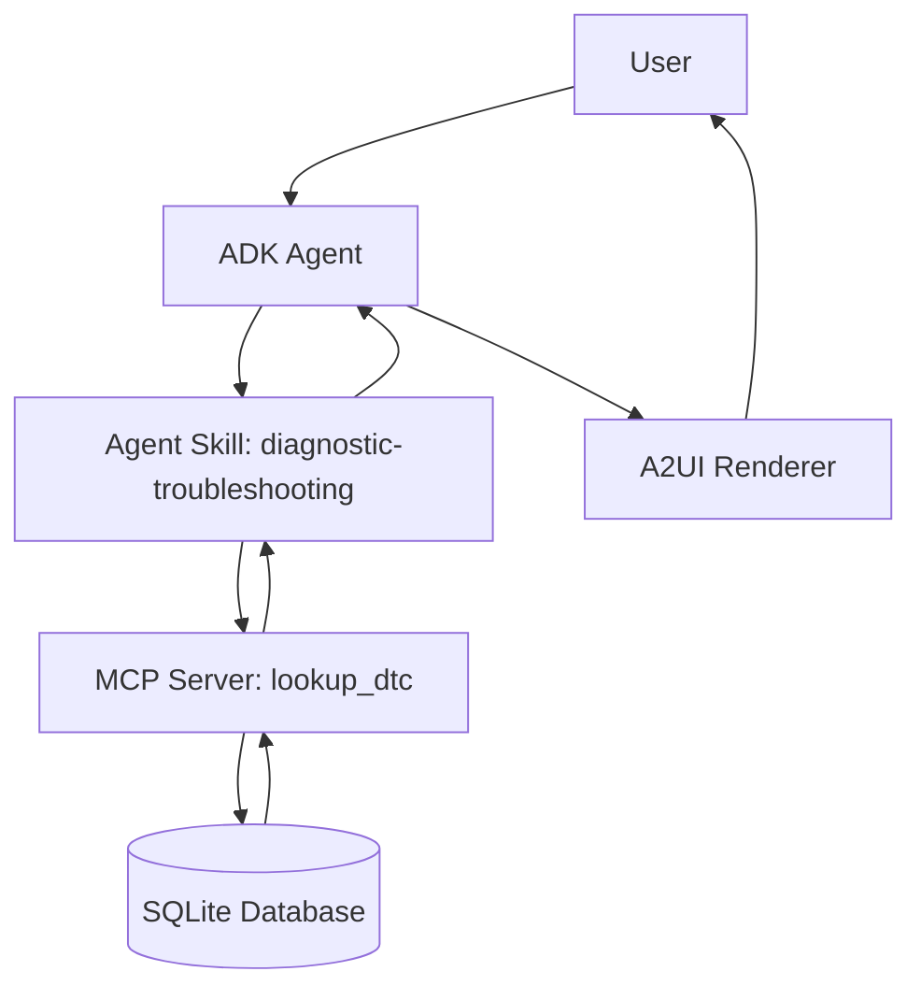

# DiagAssist – Hackathon Pitch

## Problem

Mechanics and service advisors lose time every day manually searching repair
manuals, forums, and OEM documentation to interpret a single Diagnostic
Trouble Code (DTC). This slows diagnosis, increases customer wait time, and
leads to inconsistent repair quality across technicians of different
experience levels.

## Solution

DiagAssist is an AI-powered diagnostic planner that turns a raw DTC into a
structured, ready-to-act repair plan in seconds. A user enters a code (or
asks a question about one), and the system retrieves grounded repair data,
explains it in plain language, and presents it as a clear Repair Card with a
severity badge and a step-by-step checklist — without ever inventing facts
that aren't backed by the underlying data source.

## Architecture

- **MCP Server** isolates all factual data access behind one well-defined
  tool (`lookup_dtc`), so the data source can later be swapped for a live
  OEM database without touching the agent logic.
- **Agent Skill** (`SKILL.md`) encodes exactly when to call the tool, when to
  refuse, and how to handle edge cases — making the agent's behavior
  auditable and testable rather than buried in a prompt.
- **A2UI Renderer** turns structured data into a Repair Card, Status Badge,
  and Checklist, the same shape a technician already expects from a shop
  management tool.
- **Evaluation suite** (`evals.py`) keeps the system honest as it evolves,
  catching regressions in grounding, refusal behavior, and error handling.

## Business Value

- **Faster diagnosis** — cuts manual manual-lookup time from minutes to
  seconds per code.
- **Consistency** — every technician gets the same grounded repair guidance,
  reducing variance in repair quality.
- **Extensible** — the MCP boundary means the mock SQLite database can be
  replaced with a live OEM feed, a fleet management system, or a parts
  inventory lookup without rewriting the agent.
- **Trustworthy by design** — grounding constraints and the evaluation suite
  directly address the #1 risk in shop-floor AI tools: confidently wrong
  repair advice.

## Demo Script

1. Start the app: `python main.py`.
2. Enter `P0420` — show the Repair Card with severity, time estimate, and
   checklist rendering instantly.
3. Enter `What is P0300 and how serious is it?` — show that natural-language
   questions work just as well as raw codes.
4. Enter `Tell me a joke` — show the agent politely refusing and staying on
   task.
5. Enter `P9999` — show a clear "not found" response instead of a fabricated
   answer.
6. Enter `I have codes P0420 and P0171, what's going on?` — show both codes
   processed and rendered as separate cards.
7. Run `python tests/evals.py` — show the automated evaluation report passing
   all test cases live.

## Future Roadmap

- Replace mock SQLite data with a live OEM/Aftermarket DTC database or
  real-time OBD-II adapter integration.
- Add a true LLM-backed reasoning layer on top of the grounded tool calls for
  richer explanations, while preserving the no-hallucination guarantee.
- Build a native A2UI web/mobile renderer for shop-floor tablets.
- Add session history per vehicle (VIN-linked) for service advisors.
- Extend the MCP server with additional tools: parts lookup, technician
  scheduling, and labor cost estimation.

## 5-Minute Presentation Outline

1. **(30s) The Problem** — manual DTC lookup wastes shop time and creates
   inconsistent repairs.
2. **(60s) The Solution** — live demo of entering `P0420` and getting an
   instant, grounded Repair Card.
3. **(60s) Architecture** — walk through the Mermaid diagram: Agent → Skill →
   MCP → SQLite → A2UI, emphasizing the grounding boundary at the MCP layer.
4. **(60s) Trust & Evaluation** — show the refusal case and the invalid-code
   case, then run `evals.py` live to show automated regression coverage.
5. **(45s) Business Value** — speed, consistency, extensibility for real shop
   systems.
6. **(45s) Roadmap & Q&A** — live OBD-II integration, LLM-backed reasoning,
   native A2UI rendering, open the floor for questions.
