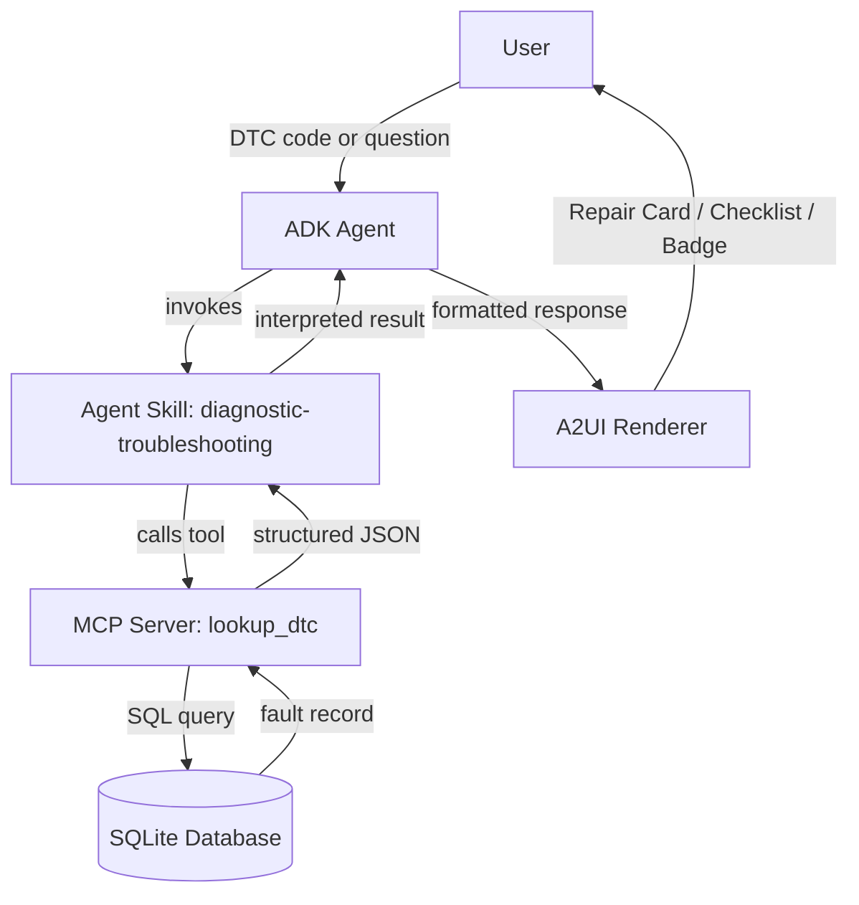

# DiagAssist – Technical Design Document

## Problem Statement

Mechanics and service advisors spend significant time manually searching repair manuals,
forums, and OEM documentation to interpret a single Diagnostic Trouble Code (DTC). This
slows down diagnosis, increases customer wait time, and introduces inconsistency between
technicians of varying experience levels.

## Solution

DiagAssist is an AI-powered diagnostic planner that accepts a DTC code (or a natural
language question containing one), retrieves grounded repair information from a local
database through an MCP (Model Context Protocol) Server, reasons over that data using an
Agent Skill, and presents a structured, actionable repair plan through an A2UI-style
interface (Card + Checklist + Status Badge).

The system is explicitly grounded: the agent never invents repair steps. All factual
content (description, severity, estimated time, repair steps) comes directly from the
MCP tool's database lookup. The agent's role is limited to interpretation, formatting,
and conversational framing.

## User Journey

1. User enters a DTC code (e.g. "P0420") or asks a question containing one
   (e.g. "What is P0300?").
2. The ADK Agent parses the input and identifies a diagnostic request.
3. The Agent invokes the Agent Skill `diagnostic-troubleshooting`.
4. The Skill calls the MCP tool `lookup_dtc(code)`.
5. The MCP Server queries the SQLite database and returns structured fault data.
6. The Agent interprets the returned data (without altering facts) and explains it in
   plain language.
7. The A2UI renderer converts the structured response into a Repair Card with a
   severity badge and a repair checklist.
8. The user receives a clear, structured repair plan they can act on immediately.

## Architecture Diagram

## Data Flow

1. **Input capture** — `agent.py` receives raw text from the user (CLI or API call).
2. **Code extraction** — A simple regex (`P0\d{3}` / `P\d{4}` pattern) inside the agent
   or skill layer extracts a DTC code from free-form text. If no code is found and the
   message is unrelated to diagnostics, the skill refuses the request.
3. **Tool invocation** — The skill calls the MCP tool `lookup_dtc` with the extracted
   code as the only argument.
4. **Database lookup** — `mcp_server.py` opens a connection to `dtc_database.db`
   (built by `database.py`) and runs a parameterized `SELECT` query against the `dtc`
   table.
5. **Result handling** —
   - If found: the row is converted into a JSON object (`description`, `severity`,
     `estimated_time`, `repair_steps`) and returned to the skill.
   - If not found: an explicit `{"error": "DTC not found"}` payload is returned. The
     agent never fabricates a fault for an unknown code.
6. **Response formatting** — The agent wraps the tool's structured output in a short
   natural-language explanation, but does not change any technical fact from the
   tool result.
7. **UI rendering** — `ui_renderer.py` takes the final structured payload and renders a
   Card component (title = code), a Status Badge (color-coded by severity), and a
   Checklist component (one line per repair step).

## Risks

- **Hallucination** — The agent could invent repair steps or fault explanations not
  present in the database, especially for ambiguous or partially-recognized codes.
- **Missing DTC** — A user may submit a code that does not exist in the mock dataset,
  or a malformed code (e.g. "P420" instead of "P0420").
- **Database errors** — The SQLite file may be missing, locked, or corrupted, or the
  schema may not match what the MCP server expects.
- **Ambiguous input** — Free-form questions ("my check engine light is on") may not
  contain an extractable code, and the agent must avoid guessing.
- **Out-of-scope requests** — Users may ask unrelated questions (jokes, general chat),
  which the skill must politely decline rather than attempting to answer.

## Mitigations

- **Ground responses using MCP data only** — The agent's system instructions and the
  Skill's behavior explicitly forbid stating any fault description, severity, time
  estimate, or repair step that did not come verbatim from a `lookup_dtc` tool result.
- **Explicit "not found" handling** — `mcp_server.py` returns a structured error object
  rather than `None` or an exception, so the agent can present a clear, friendly
  "code not recognized" message instead of guessing.
- **Schema validation on startup** — `database.py` checks for the existence and shape of
  the `dtc` table before the server starts accepting tool calls.
- **Input validation** — A regex-based DTC pattern check happens before any database
  query, rejecting clearly malformed codes early with a helpful message.
- **Scope refusal** — The Skill's `SKILL.md` instructions explicitly state that any
  request unrelated to DTC diagnostics (jokes, general trivia, etc.) must be politely
  declined, keeping the agent on-task.
- **Evaluation suite** — `evals.py` runs automated test cases covering valid codes,
  natural-language questions, invalid codes, multiple codes, and off-topic requests to
  catch regressions before deployment.
